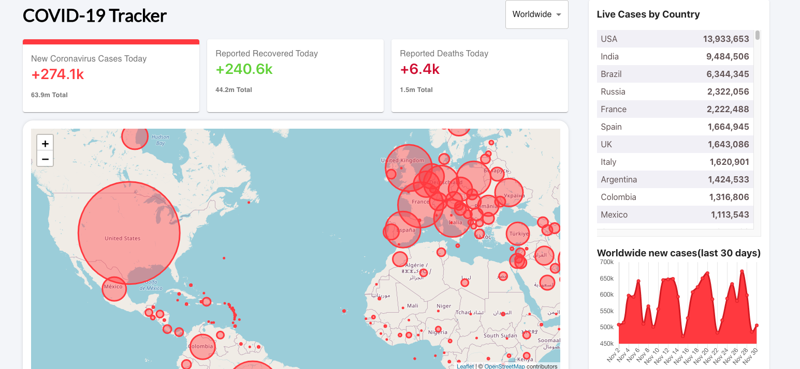

# Covid-19 Tracker

## Description

Track worldwide coronavirus cases, recoveries, and deaths for each country with this Covid-19 Tracker application. This application was built using React.js, Material UI for styling, react hooks to manage state, Leaflet.js for map displays, chart.js for chart displays, and firebase for web hosting.

## Table of Contents

- [Description](#description)
- [Technology](#technology)
- [User Story](#user-story)
- [Installation](#installation)
- [Usage](#usage)
- [License](#license)
- [Contributing](#contributing)
- [Tests](#tests)
- [Questions](#questions)
- [Deployed Application URL](#deployed-application-URL)

## Technology

- React.js
- Firebase
- React Hooks
- Leaflet.js
- Chart.js
- Material UI
- CSS
- HTML
- JavaScript
- Disease.SH API

## User Story

As a World Health Medical professional, I want a webpage that shows daily coronavirus cases for each country SO THAT we can send necessary aid to countries reporting an increase in coronavirus cases.

## Installation

npm install in order to install any dependencies

## Usage

The deployed link will take you to the homepage. The homepage will display worldwide new coronavirus cases, recovered, and deaths reported. Click on individual circles on the map or use the dropdown menu to show coronavirus data for a specific country.

## License

## Contributing

Please follow standard contributing guidelines.

## Tests

No tests to run.

## Questions

For any questions, please contact kendayao at kendayao@gmail.com

## Deployed Application URL

Deployed application link: https://instagram-clone-bf736.web.app/

